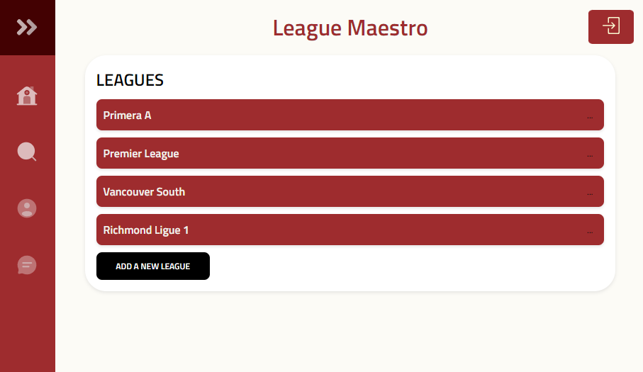
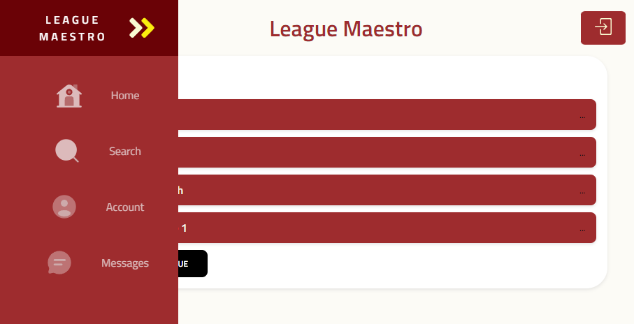
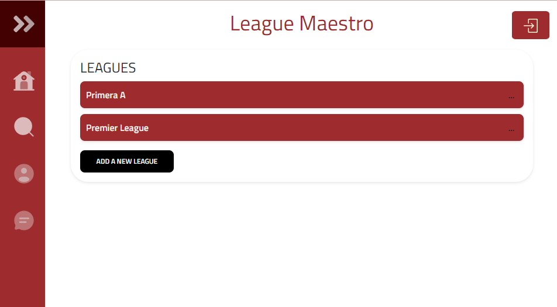
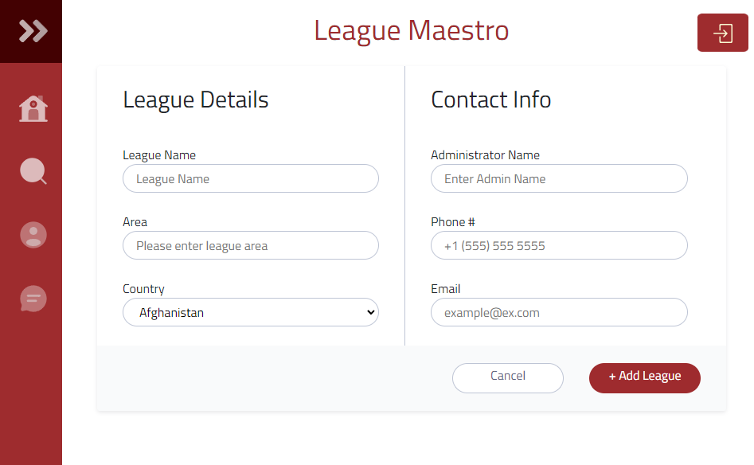
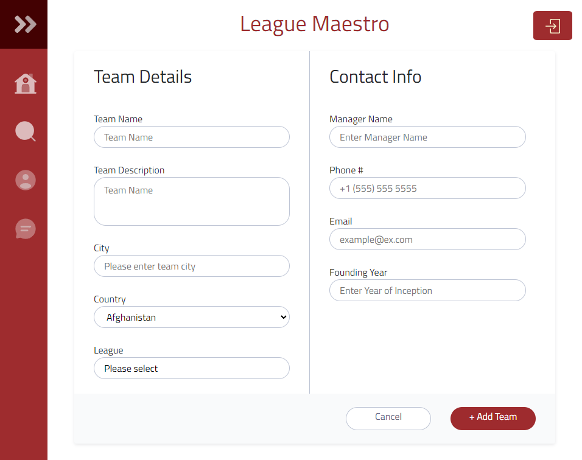
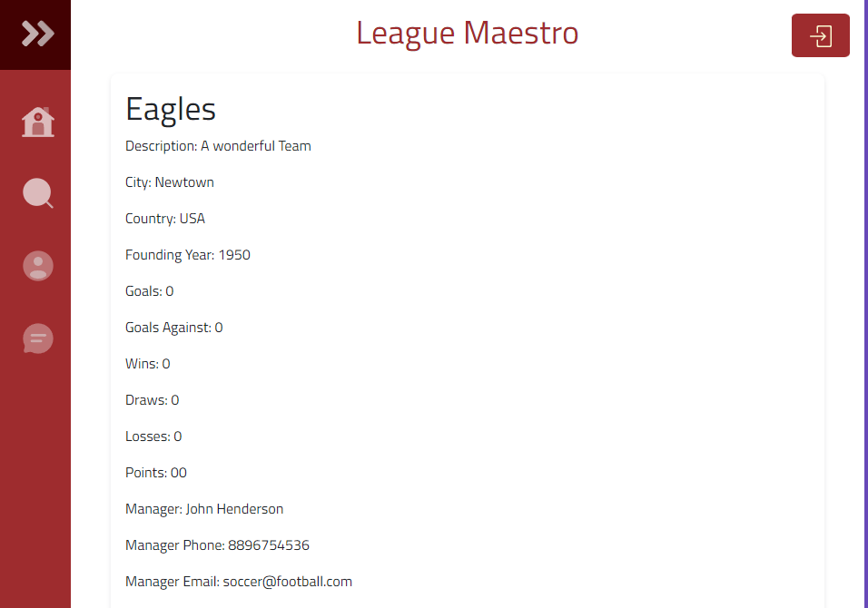

# League Maestro

## Overview

League manager for amatuer sports that will allow greater communication between players managers and the league as well with officiating. The overall goal is to increase the competitiveness of ameteur sports in any given area. Statistics being tracked and validated by officials.

### Problem

League managment applications are not in competition with any other supplier leading to higher than expected costs. Also the level of quality and communication is heavily lacking. I would like to change the fundamental way touranaments are organized and funded.

### User Profile

League managers will use my app alongside team managers and players. All user bases will have to be catered towards.
-players
-managers
-league managers
-officials
-fans

### Features

Players - ability to check standings, upcoming games, confirm appearance, check position, managers notes, statistics

Managers - ability to check player stats, write notes to each player, schedule practices, communicate with the league manager

League Manager - ability to oversee all input and manipulate data.

Officials - ability to post match scores and statistics alongside notes for the league manager.

For the fans - ability to play fantasy football with the registered players this will be a low priority feature

## Implementation

### Tech Stack

- React
- TypeScript
- MySQL
- Express
- Client libraries:
  - react
  - react-router
  - axios
  - chart.js
  - leaflet for maps
  - multiple.js
  - moment.js
  - Omniscient.js
  - parsley for form validation
  - popper.js for button menu's
  - Ionic for mobile efficiency
- Server libraries:
- - SQL
  - knex
  - express
  - bcrypt for password hashing
  - node.js
  - mocha.js for performance testing

#### Home Page



#### Home Page - SideBar



#### Account Page



#### Personnel Page



#### Settings Page



#### Home Page Nav



### Data

Four tables with foreign keys for league team and officials

### Endpoints

**GET /teams**

- Get standings, with the statistical info

Response:

```
[
    {
        "id": 1,
        "league_id": 3,
        "team_name": "Jaguars",
        "wins": 21,
        "lost": 6,
        "drew": 2,
        "points": 65,
        "goals": 98,
        "goals_against": 44
    },
    ...
]
```

**GET /leagues**

- Get leagues, with the data on each league

Response:

```
[
    {
        "id": 1,
        "league_name": "East side premier league",
        "number_of_teams": 15,
        "number_of_players": 187,
        "bank_account": "$23000",
        "officials": [officals],
        "teams": [teams],
        "players": [players],
        "managers": [managers]
    },
    ...
]
```

### Auth

- JWT auth
  - Before adding auth, all API requests will be using seeded data from the premier league
  - Added after core features have first been implemented
  - Store JWT in localStorage, remove when a user logs out
  - Add states for logged in showing different UI in places listed in mockups

## Roadmap

- Create client

  - react project with routes and boilerplate pages

- Create server

  - express project with routing, with placeholder 200 responses

- Create migrations

- Create multiple leagues and populate them with teams at different parts of the season.

- Create seeds with sample league data

- Deploy client and server projects so all commits will be reflected in production

- Feature: List leagues

  - Implement list leagues page
  - Create GET /leagues endpoint

- Feature: List teams

  - Implement list teams page
  - Create GET /teams endpoint

- Feature: Home page

- Feature: Create account

  - Implement register page + form
  - Create POST /users/register endpoint

- Feature: Login

  - Implement login page + form
  - Create POST /users/login endpoint

- Feature: Implement JWT tokens

  - Server: Update expected requests / responses on protected endpoints
  - Client: Store JWT in local storage, include JWT on axios calls

- Bug fixes

## Nice-to-haves

- Practice meet up maps and player training schedules with.
- Structured data on players for future AI scouting uses
- Tournament creation and creative funding schemes with local advertising opportunites.
